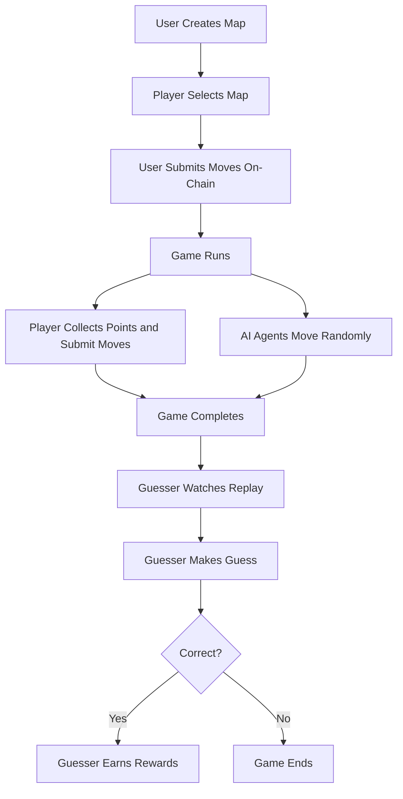

<a href="https://guess-the-human.vercel.app/">
  <h1 align="center">Guess The Human</h1>
</a>

<p align="center">
Submission for ETH Oxford 2025 under AirDAO, BNB Chain & GatlingX.
</p>

<p align="center">
  <a href="#how-the-game-works"><strong>How The Game Works</strong></a> ·
  <a href="#todo"><strong>TODO</strong></a> ·
  <a href="#diagram"><strong>Diagram</strong></a> ·
  <a href="#clone-and-run-locally"><strong>Guide</strong></a> ·
</p>
<br/>

## How the Game Works

Guess The Human is a blockchain-based AI-driven game where players attempt to identify the human-controlled player among AI agents moving randomly on a 2D grid. The game consists of two main roles: players and guessers.

### Game Setup

A user creates a game board (grid with walls with yellow and red balls).

The player selects a map to play on.

The website renders the map.

### Player Submission

The human-controlled player submits 20 moves (left, right, up, down) as an on-chain transaction.

Players earn points by collecting yellow balls on the grid.

Players lose points by collecting yellow balls on the grid.

The goal is to maximize points by planning efficient movements.

### Guessing Phase

The guesser watches the game as the moves are played out.

AI agents and the human-controlled player move at the same time.

The guesser tries to identify which character is human.

If the guesser is correct, the humna loses their score.

## TODO

### Contracts

-   [x] Create Game Board Structure (Rows, Columns, Content / Map, Starting Position)
-   [x] Add function to Create Game Board
-   [x] Add function to Submit Play
-   [x] Add function to Read Game Board

### Frontend

-   [x] Add 2D Map Parser Logic
-   [x] Display Map of game
-   [x] Add Game Moving Logic with Contract Write
-   [ ] Display AI Moves
-   [ ] Add Guess Logic
-   [ ] Add Landing Page

## Diagram



## Clone and run locally

### Contracts Instructions

### Frontend Instructions

1. Enter the frontend directory and install the dependencies needed

    ```bash
    yarn install
    ```

2. You can now run the Next.js local development server:

    ```bash
    yarn dev
    ```

    The frontend should now be running on [localhost:3000](http://localhost:3000/).
